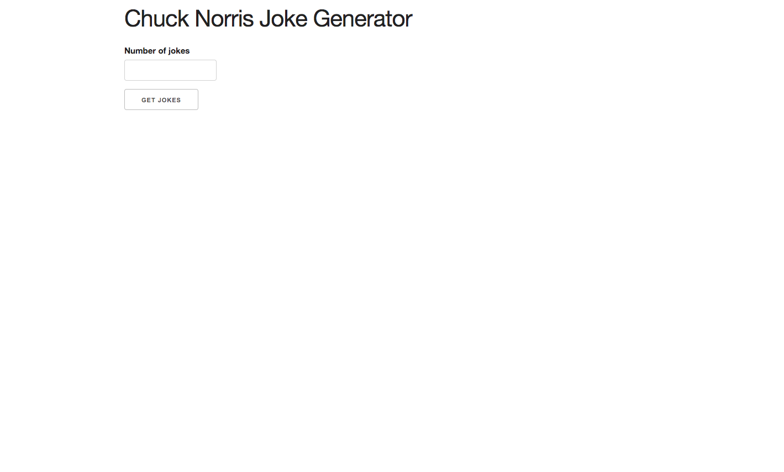
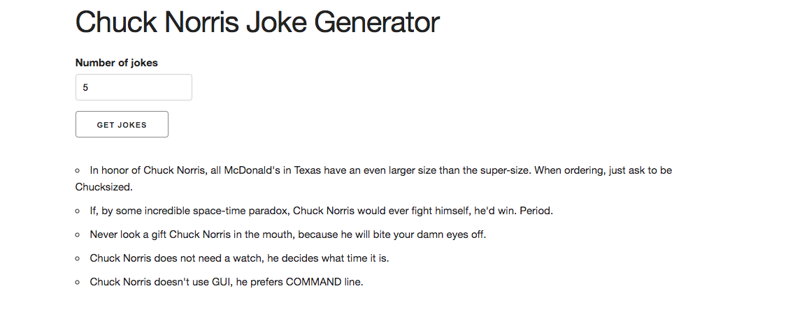

# Chuck-Norris-API-Jokes

## Application  description:

Designed an application that takes an external API  returning chuck norris jokes. The user is able type  and request in the amount of jokes they want and then the api fetches the jokes. 

 ## Click [here]( https://brianlevin.github.io/Chuck-Norris-API-Jokes/) for the live app. 
 
 This is the home screen:
 
 
  
  
 The user then puts in the amount of jokes they want and the api will fetch those jokes:
 
  
  
  
   
## Libraries and Frameworks:

- HTML
- CSS
- Javascript

## Email:

bml201095@gmail.com

